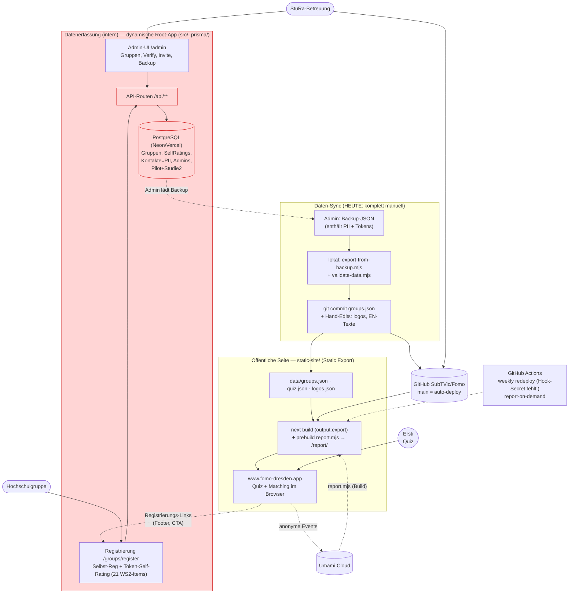

<!-- SPDX-License-Identifier: AGPL-3.0-only -->

# Übergabe-Audit FOMO → StuRa

**Stand:** 03.10.2026 · **Autor:** Claude Code (KI-Audit, nur lesend; keine Prod-Systeme berührt)
**Methode:** Code gelesen, beide Apps lokal gebaut/gestartet, Gruppen-Bearbeitung
lokal im Browser durchgespielt, 5 „frische KI-Instanzen" (Persona B) auf typische
Aufgaben losgelassen, GitHub-Deployments/Workflows per API geprüft.

**Ergänzend:** `recherche-umsetzung.md` (Web-Recherche, Zielbild StuRa-Server) und
`umsetzungsplan.md` (Arbeitspakete für die KI-gestützte Umsetzung).

Kennzeichnung: **[V]** selbst verifiziert (ausprobiert / im Code gesehen) ·
**[?]** Vermutung, nicht verifizierbar (Vercel-/Account-Interna) → sammelt sich
in „Offene Fragen". Verweise als `Datei:Zeile`, relativ zum Repo-Root bzw. zu
`static-site/`, wo angegeben.

---

## 1. Kurzfazit

FOMO besteht aus **zwei** Apps: der **statischen Seite** (`static-site/`, live auf
www.fomo-dresden.app, robust, quasi wartungsfrei) und der **dynamischen Root-App**
(`src/`, DB + Admin + Registrierung), die die Daten liefert. Die öffentliche Seite
ist solide; **alle Übergabe-Risiken sitzen in der Datenpflege und in der
dynamischen App.**

Größte Hürden für den StuRa:
1. **Die dynamische App ist seit 30.06.2026 nicht mehr deploybar** [V] — jeder Build
   scheitert an einem TypeScript-Fehler (`scripts/export-static-site-groups.ts:117`).
   fomo-pi.vercel.app läuft auf dem Stand von Ende Juni; jede Änderung (Env, Secret,
   Sicherheitsupdate) bliebe hängen.
2. **Kritische Auth-Lücke** [V]: Admin-APIs sind unter bestimmten, von außen
   auslösbaren Bedingungen ohne Passwort erreichbar (next-auth-Beta „fail-open").
3. **Daten gehen nur von Hand live** [V]: Backup → Skript → Commit. Letzter Sync
   17.08.; seitdem ist nichts Neues online, auch nicht kurz vor der Erstiwoche.
4. **Jede Gruppen-Korrektur wirft die Gruppe aus dem Quiz**, bis ein Admin sie neu
   verifiziert [V]; Hand-Edits in `groups.json` werden beim nächsten Export
   überschrieben (ESG-Link nachweislich verloren) [V].
5. **Alles hängt an Privat-Accounts** einer Einzelperson (GitHub-User, Vercel-Hobby,
   Domain, Impressum auf Privatadresse) [V/?].

Top-5-Empfehlungen (Details §5/§6): **(A)** dynamische App verschlanken zu einem
reinen Registrierungs-/Bearbeitungstool und die Auth-Lücke schließen **vor** der
Erstiwoche; **(B)** Daten-Sync automatisieren (GitHub Action statt Handarbeit) und
`validate-data.mjs` in den Build ziehen; **(C)** dauerhaften, selbst-anforderbaren
Bearbeitungslink statt Einmal-Token; **(D)** Repo in eine Organisation, Vercel-Team,
Domain und Impressum weg von der Privatperson; **(E)** `CLAUDE.md` + Runbooks
(Entwürfe liegen bei) als KI-Leitplanken, damit Persona B nicht in `groups.json`
statt in die DB schreibt.

---

## 2. Architektur-Skizze

Rot = die dynamische App und ihre DB: aktuell **nicht deploybar**, sicherheits-
kritisch, der eigentliche Wartungsklotz. Grün-neutral = die statische Seite
läuft stabil, solange `groups.json` gepflegt wird.

---

## 3. Ist-Zustand

### a) HSG-Datenfluss

- **Eine Quelle der Wahrheit für Gruppen = die DB der Root-App.** Live wird aber
  nur, was jemand von Hand überträgt: Admin-Login → „Backup herunterladen" →
  `cd static-site && node scripts/export-from-backup.mjs --backup <datei>` →
  `node scripts/validate-data.mjs` → `groups.json` committen → Vercel baut [V].
- **Letzter Sync: 17.08.2026** (`static-site/data/groups.json` → `_meta.generatedAt`)
  [V]. Alles, was Gruppen seither eingereicht haben, ist **nicht live**.
- **Jede Einreichung einer Gruppe setzt `isVerified=false`**
  (`src/app/api/groups/register-attributes/route.ts:133`). Der Exporter nimmt nur
  `isVerified && selfRating` als echtes Rating
  (`static-site/scripts/export-from-backup.mjs:80`); sonst wird die Gruppe als
  `derived:true` (nur Verzeichnis, nicht im Quiz) exportiert. **Eine Gruppe, die
  korrigiert, fällt also aus dem Quiz, bis ein Admin sie erneut verifiziert.** Lokal
  reproduziert [V].
- **Hand-Edits in `groups.json` werden beim nächsten Export überschrieben.** Belegt:
  Der ESG-Website-Fix aus Commit `846815c` ist durch den Sync `cf5c126` wieder auf
  `https:/www.esg-dresden.de` (fehlender Slash) zurückgefallen und steht so in HEAD
  [V]. Dasselbe Risiko trifft die Kategorie-Hand-Edits `79230cf`/`3447425`, falls die
  DB nicht nachgezogen wurde [V Code, ? DB-Stand].
- **Gruppen und Studis beantworten dieselben 21 WS2-Items.** Die in `CLAUDE.md`
  (Phase 2) beschriebene Entkopplung „Gruppen auf Attribut-Ebene, Fragen änderbar
  ohne die Gruppen" **gibt es nicht mehr** — gematcht wird Item-für-Item
  (`static-site/src/lib/matching.ts:58`) [V].
- **Items liegen doppelt:** `data/working-set-v2.json` (Registrierung/Admin) und
  `static-site/data/quiz.json` (live). Aktuell inhaltlich gleich (21 IDs/Texte),
  aber nur von Hand synchron zu halten; nichts prüft die Gleichheit [V].
- **Logos, EN-Übersetzungen, Hand-Korrekturen leben außerhalb der DB** und werden von
  keinem Exporter angefasst — sie müssen bei jedem Sync manuell nachgezogen werden
  (nirgends dokumentiert) [V].
- **Kategorien:** maßgeblich ist die DB (`Category`); `static-site/src/lib/categories.ts`
  hat nur SEO-Texte für 8 von 11. Mehrere Hand-Korrekturen stehen nur in `groups.json`
  und laufen beim nächsten Export Gefahr, überschrieben zu werden [V].

### b) Dynamische Seite im Detail

- **33 API-Routen, ~12 Admin-Seiten, 7 öffentliche Seiten.** Inventar, Rollen und
  „nach Launch nötig?" in `docs/uebergabe/` (Rohdaten der Subagenten); Kern bleibt:
  Registrierung + Token-Self-Rating + Admin-Gruppen; **Pilot, Studie 2, Demo-Tour,
  altes Root-Quiz, SiteConfig-CMS sind Altlasten** (~61 % des Codes in `src/`).
- **Auth (kritisch) [V]:** Viele Admin-API-Routen prüfen die Anmeldung zu schwach;
  zusammen mit einer bekannten Lücke der eingesetzten next-auth-Beta sind sie ohne
  Passwort erreichbar. **Lokal reproduziert** (nur gegen eine lokale Test-Instanz).
  Reproduktionsdetails bewusst **nicht** in diesem öffentlichen Repo; sie liegen dem
  Projektteam vor. Fix: zentraler `requireAdmin()`-Helper (prüft `session?.user`,
  Rolle und Aktiv-Status in der DB) + Update auf `next-auth@5.0.0-beta.32`
  (siehe `umsetzungsplan.md` WP-1.2).
- **Rollen:** faktisch keine Trennung — EDITOR darf fast alles (Backup mit allen PII,
  Löschen, destruktiver CSV-Import). Rollencheck nur bei `/admin/users*`
  (`api/admin/users/route.ts:15`) [V]. Schutz des letzten SUPER_ADMIN greift nicht
  (`session.user.id` ist undefined) [V]. Logout-Button kaputt (fehlendes CSRF-Token)
  [V Code].
- **Einladungs-Tokens:** 128 Bit Entropie (`crypto.randomBytes(16)`), 30 Tage gültig,
  **einmalig** (atomarer Claim, `register-attributes/route.ts:112`). Kein Widerruf
  alter Tokens, Tokens im Klartext in DB + Backup. **Kein Mailversand im Code** — der
  Admin kopiert den Link von Hand [V].
- **Selbst-Registrierung ohne Token** legt immer eine **neue inaktive** Gruppe an;
  bestehende werden nie überschrieben (nur `duplicateOfGroupId` gesetzt). Rate-Limit
  3/h/IP, aber **in-memory** → auf Vercel serverless praktisch wirkungslos [V].
- **PII:** `GroupContact` (Name/Mail), `Group.contactPerson` (laut Schema „intern"),
  Invite-Mails, Admin-Mails, Pilot-/Studie-2-Freitexte. **Kein Löschkonzept, keine
  Aufbewahrungsfrist, kein Impressum/Datenschutz der Root-App** [V]. **`/groups`
  leakt `contactPerson` + `onboardingInfo`** in den öffentlichen Seiten-Payload —
  **lokal verifiziert** (Testwerte tauchten im HTML auf) [V].
- **Build migriert die Prod-DB** bei jedem Deploy
  (`package.json:7`: `prisma migrate deploy && next build`) — Migration läuft **vor**
  dem Build; schlägt der Build fehl, ist die DB schon migriert [V].

### c) Statische Seite im Detail

- **Build:** `prebuild` (`report.mjs` → `/report/`) + `next build` (`output:"export"`);
  Daten aus `data/*.json` werden statisch importiert, **kein** Laufzeit-Fetch [V].
- **`validate-data.mjs` läuft im Vercel-Build NICHT** — nur im Docker-Pfad. Die
  Betriebshandbuch-Aussage „Vercel prüft die Datei beim Bauen" stimmt nur für
  JSON-**Syntax**. **Falsche Werte gehen unbemerkt live** — getestet [V]: ungültiger
  Rating-Wert (`2`), doppelter Slug, unbekannter Filtername, URL ohne `https://`
  brechen den Build **nicht** ab; ein Rating-Wert außerhalb −1/0/1 kann Scores negativ
  machen und die Gruppe aus den Ergebnissen kippen.
- **Laufzeit-Abhängigkeit:** nur die Registrierungs-Links auf `fomo-pi.vercel.app`
  (Footer/CTA, ~300×). Fällt die dynamische App aus, funktioniert das Quiz weiter;
  nur „Registrieren/Profil bestätigen" bricht [V].
- **Analytics:** Umami (anonym, keine Cookies). **Aber:** `quiz-response` sendet den
  vollen 21er-Antwortvektor, `self-recognition` zusätzlich die Gruppen­mitgliedschaft
  (teils religiöse/politische Gruppen → ggf. Art. 9 DSGVO). Datenschutzerklärung nennt
  Umami-Anbieter/Serverstandort/Opt-out **nicht** und trägt noch einen
  `PLACEHOLDER`-Kommentar [V]. **Juristisch prüfen lassen.**
- **7 verifizierte Gruppen mit kaputten Website-/Instagram-Links** (relative URLs →
  404); u. a. `effektiver-altruismus`, `progressiv-am-campus`, ESG. Blockiert zugleich
  das Bearbeitungsformular (zod `.url()` lehnt Vorbelegung ab, Fehlermeldung ohne
  Feldangabe) [V].
- **EN-Texte:** Fallback erzeugt Denglisch für Gruppen ohne Übersetzung; veraltet
  still, wenn der deutsche Text sich ändert (ESG nachgewiesen) [V].
- **Kein Test für das Live-Matching**; `report.mjs` hält eine Kopie der Matching-Logik
  („KEEP IN SYNC") ohne Gleichheits-Test [V]. In `CLAUDE.md` beschriebene Mindestzahl
  „≥5 Antworten" ist **nicht** implementiert [V].
- **Toggle „unbestätigte Gruppen" steht per Default auf AN** (`GroupBrowser.tsx:22`),
  anders als Doku/`CLAUDE.md` („hinter einem Toggle") [V].

### d) Infrastruktur und Betrieb

| Dienst | Wofür | Account | Kosten | Kritisch |
|---|---|---|---|---|
| Vercel `fomo-static` | öffentliche Seite | Default-Team Repo-Owner [?] | 0 € (Hobby) [?] | ⭐ |
| Vercel `fomo` (+Zwilling `fomo-utsx`) | dynamische App | derselbe [V] | 0 € [?] | ⭐ (Build kaputt) |
| PostgreSQL (Neon/Vercel) | DB der Root-App | ? | Free [?] | ⭐ |
| Domain fomo-dresden.app | Live-Domain | DNS bei Vercel [V]; Registrar ? | ~15 €/J | ⭐ |
| Umami Cloud | Analytics + /report/ | ? | Free [?] | mittel |
| GitHub `SubTVic/Fomo` | Code+Daten | **User-Account**, `main` **ohne** Branch-Schutz [V] | 0 € | ⭐ |
| E-Mail fomo@yeti-dresden.org | Impressum/Kontakt | YETI (Google Workspace) [V] | bei YETI | ⭐ |
| Anthropic API | Scraper (optional) | persönlicher Key [?] | pay-per-use | nein |
| Mailversand | — | **existiert nicht** [V] | — | — |

- **Deployments [V]:** `fomo-static` wird bei jedem Push auf `main` gebaut (zuletzt
  26.08.). **`fomo`/`fomo-utsx` schlagen seit 30.06. bei JEDEM Build fehl** (per
  GitHub-API geprüft). Ursache lokal reproduziert: `next build` bricht an
  `scripts/export-static-site-groups.ts:117` ab (TS2322; `tsconfig.json` zieht
  `scripts/**` mit ein).
- **Weekly-Report-Redeploy [V]:** Alle 12 Läufe „success", aber der Job-Log zeigt
  „VERCEL_DEPLOY_HOOK_URL secret not set — skipping". **Der Montags-Refresh tut also
  nichts**; `/report/` aktualisiert sich nur bei einem ohnehin ausgelösten Deploy.
- **Backups/Monitoring/Logging:** nur der manuelle JSON-Download auf private Rechner;
  **kein Restore-Weg, kein Uptime-Monitor, kein Error-Logging** [V/?].
- **Kosten-Risiko Umami:** grob ~35 Events je Quiz-Durchlauf; bei ~40 % von 6.300
  Erstis im selben Monat ≈ 100 k Events → Hobby-Limit kann reißen [? Limit].
- **Vercel-Hobby** ist laut ToS „non-commercial personal use" — für ein StuRa-finan-
  ziertes Projekt rechtlich zu klären [?].

### e) Code-Gesundheit

- **Root `npm run build`: FAIL** (TS2322, s. o.) [V]. **`tsc --noEmit`: 1 Fehler**
  (dieselbe Zeile) [V]. **`vitest`: 7/7 Matching-Tests grün**, aber die 6 Playwright-
  Specs scheitern unter vitest (keine Trennung von E2E/Unit; `vitest` sammelt die
  `.spec.ts` ein) [V]. **ESLint läuft faktisch nicht** (`next lint` deprecated +
  interaktiver Setup-Prompt; `eslint.ignoreDuringBuilds:true`) [V].
- **static-site `npm run build`: grün** (~28 s, 213 Routen) [V]; `tsc`: grün;
  4 ESLint-Fehler (`react/no-unescaped-entities`), per `ignoreDuringBuilds`
  unterdrückt [V].
- **`npm audit`:** Root **40 Lücken** (4 kritisch: `next`, `next-auth`, `@auth/core`,
  `vitest`; `next`-Fix 15.5.27 *ohne* Major) [V]; static-site **5** (kritisch: `next`;
  Fix 15.5.27) [V]. **Keine CI auf PRs** (`ci.yml` existiert auf `main` nicht mehr) [V].
- **Tote/irreführende Stellen (Auszug) [V]:** `CLAUDE.md` beschreibt 17 Binär-Attribute,
  `APP_MODE` (im Code nur `APP_LIVE`), v1-Matching + „≥5 Antworten"; README-Pfad
  `cd Fomo/Github/fomo` falsch; `src/lib/study2/items.ts` ist in Wahrheit das Kern-
  Item-Set der Registrierung; Filter `party` = „Hochschulpolitik" (nicht „Feiern");
  `data/admin-export.json` (102 Pilot-Sessions mit Freitexten) **committet im
  öffentlichen Repo**; Dev-Admin mit festem Passwort im Seed.

---

## 4. Wartungsaufgaben (heute)

Persona A = StuRa-Mitglied, Browser/Tabellen, kein Git/Terminal.
Persona B = frische KI-Instanz, bekommt Repo + 1 Satz. (Persona-B-Spalte aus den
5 real durchgeführten Tests.)

| # | Aufgabe | Heute | Schritte | Code/DB-Zugriff? | Persona A? | Persona B? | Hauptproblem |
|---|---|---|---|---|---|---|---|
| 1 | Gruppe ändert Attribute/Beschr./Logo | Admin erzeugt Token-Link → Gruppe füllt neu aus → Admin verifiziert → Export → Commit | 6–8 | DB **und** Terminal/Git | ❌ | ⚠️ nur `groups.json` (wird überschrieben) | Einreichung setzt `isVerified=false`; Logo gar nicht über UI; Hand-Edit flüchtig |
| 2 | Neue Gruppe → ins Quiz | Gruppe registriert sich (21 Items) → Admin aktiviert+verifiziert → Export → Commit | 6–8 | DB + Terminal/Git | ❌ | ⚠️ legt nur „unbestätigt" an (korrekt!) | Ohne echtes Self-Rating kein Quiz-Match — KI erfindet es (richtig) nicht |
| 3 | Gruppe ausblenden/auflösen | Admin: `isActive=false` → Export → Commit | 4–5 | DB + Terminal/Git | ❌ | ⚠️ löscht aus `groups.json` (temporär) | Kein `hidden`-Feld; DB-Deaktivierung nötig, sonst kommt sie per Export zurück |
| 4 | Gruppe hat Link verloren | Admin erzeugt **neuen** Token, kopiert ihn in eigene Mail | 3–4 | DB (Admin-UI) | ⚠️ nur mit Admin-Login | ❌ kann keinen Link erzeugen | Kein Self-Service, kein Mailversand, alter Link nicht abrufbar |
| 5 | Website-Text ändern | GitHub-Webeditor `HomePageContent.tsx` (2 Stellen DE+EN) | 1–2 | nur GitHub | ✅ | ✅ | machbar; Zahlen („21", „über 90") verstreut hartkodiert |
| 6 | Quiz-Frage umformulieren | `quiz.json` **und** `quiz-translations.ts` **und** `working-set-v2.json` | 2–4 | GitHub (+DB für Konsistenz) | ⚠️ | ⚠️ ändert nur static-site (Registrierung bleibt alt) | Doppelte Quelle; EN veraltet still |
| 7 | Attribut/Item hinzufügen/umbenennen | mehrere Dateien + DB-Migration der Ratings | viele | Code + DB | ❌ | ❌ | `?r=`-Links + Report brechen still; ID-Regex `WS2-\d{2}`; Ratings verwaisen |
| 8 | Jährliche Bestätigungsrunde | Tokens erzeugen + **manuell** mailen; Rücklauf einpflegen | sehr viele | DB + Terminal/Git + Mail | ❌ | ❌ | kein Massen-Mailversand, Bulk-Invite-Button ignoriert bereits Eingeladene (Bug) |
| 9 | Statistik ansehen | www.fomo-dresden.app/report/ (+ Umami-Login) | 1 | nein | ✅ | ✅ | gut; Report veraltet nur, wenn Deploy ausbleibt |
| 10 | Admin hinzufügen/entfernen | `/admin/users` (nur SUPER_ADMIN) | 2–3 | Admin-UI | ⚠️ nur mit SUPER_ADMIN | ❌ | letzter SUPER_ADMIN nicht geschützt; Notfallzugang = DB |
| 11 | „Etwas ist kaputt" | Vercel-Deployments-Log ansehen | ? | Vercel-Login | ❌ | ❌ | kein Monitoring/Alerting; Root-Build-Fehler fiel monatelang niemandem auf |
| 12 | Jährliches Dependency-Update | `npm update` + Build + Test, 2 Apps | viele | Code + Terminal | ❌ | ⚠️ | Root-Build ohnehin rot; keine CI als Netz |

**Fazit:** Persona A schafft heute nur die rein-statischen Aufgaben (5, 9, teils 6).
Alles, was die **DB** berührt (1–4, 8, 10), braucht Admin-Login *und* einen Rechner
mit Node/Git. Persona B arbeitet vorsichtig und regelkonform, landet aber mangels
DB-Zugang **immer in `groups.json`** — also in Änderungen, die der nächste Export
überschreibt. Beide scheitern an denselben Strukturproblemen: zwei Datenquellen,
manueller Sync, Einmal-Token ohne Self-Service.

---

## 5. Vorschläge

Aufwand: S ≈ <4 h, M ≈ ½–1 Tag, L ≈ mehrere Tage. „Vor Launch?": Erstiwoche Sept.
(aus heutiger Sicht: der Launch ist faktisch gelaufen — „vor Launch" = vor dem
nächsten Haupt-Traffic / sofort).

### Spur A — Selbst machen (Persona A, minimaler Aufwand)

| # | Vorschlag | Aufwand | Vor Launch? | Vereinfacht Aufgabe | Risiko wenn nicht |
|---|---|---|---|---|---|
| A1 | **Daten-Sync automatisieren:** GitHub Action „Daten aktualisieren" — Admin lädt Backup hoch (als Workflow-Input/Artifact) oder App pusht direkt; Action ruft Exporter + `validate-data` + öffnet PR. Ersetzt Backup→Terminal→Commit. | M | ja | 1,2,3,8 | Daten veralten (seit 17.08. nichts live); Fehler nur von Hand abfangbar |
| A2 | **`validate-data.mjs` in den Build ziehen** (static-site `prebuild`), inkl. Checks für Rating-Werte, doppelte Slugs, Filternamen, URL-Form. | S | ja | 1,2,6,7 | kaputte Daten gehen still live |
| A3 | **Dauerhafter, selbst-anforderbarer Bearbeitungslink** pro Gruppe (stabiler Token, nicht Einmal; „Link neu zuschicken"-Seite). Entschärft Aufgabe 4 komplett. | M | riskant (Auth-Umbau) | 1,4,8 | Admin ist Flaschenhals; Gruppen kommen nicht an ihre Daten |
| A4 | **„Verifiziert bleibt verifiziert" bei Re-Submit:** bei unveränderter Kern-Gruppe `isVerified` nicht zurücksetzen bzw. 1-Klick-Re-Verify mit Diff-Ansicht. | S | ja | 1,4 | aktive Gruppen fallen nach Korrektur aus dem Quiz |
| A5 | **7 kaputte URLs + ESG-Link + Duplikate (Rotaract, kritmed) in der DB** bereinigen, dann 1 sauberer Export. | S | ja | 1 | tote Links live; doppelte Gruppen verzerren Ranking |
| A6 | **Logo-Pflege dokumentieren/vereinfachen** (Upload-Feld in der Registrierung ODER klarer Runbook-Weg über `logos.json`). | S–M | nein | 1 | Logos nur über Code; hängt an Einzelpersonen |
| A7 | **`report-milestones.json`-Pflege + Deploy-Hook-Secret setzen**, damit `/report/` wirklich wöchentlich aktualisiert. | S | ja | 9 | Report friert ein |

### Spur B — KI-wartbar machen (Harness)

| # | Vorschlag | Aufwand | Vor Launch? | Vereinfacht | Risiko wenn nicht |
|---|---|---|---|---|---|
| B1 | **`CLAUDE.md` überarbeiten** (Entwurf liegt: `docs/uebergabe/CLAUDE.md.entwurf`): zwei Apps, echte Datenpipeline, Do's & Don'ts, „nie `groups.json` von Hand, nie `getGroups` statt `getMatchableGroups`, nie CSV-Reimport". | S | ja | alle (B) | KI tappt in dieselben Fallen wie Persona B es tat |
| B2 | **Runbooks** (Entwürfe: `docs/uebergabe/runbooks/`): Gruppe ändern, neue Gruppe, Link verloren, Text/Frage ändern, Deploy-Troubleshooting. | S | ja | 1–6,11 | jede KI/Person re-derived alles neu |
| B3 | **Schema-Validierung als Gate** (= A2) + **Snapshot-Test fürs Matching** + **Sync-Check working-set-v2 ↔ quiz.json**. | M | ja | 6,7,12 | stille Daten-/Logikfehler |
| B4 | **Schutzgeländer technisch:** Branch-Protection auf `main` (PR + grüner Build Pflicht), CI (build+lint+test+validate) als Required Check, `.github/CODEOWNERS`. | S–M | ja | 11,12 | KI/Mensch pusht kaputt direkt auf live |
| B5 | **Trennung Inhalt ↔ Code** dokumentieren + Preview-Deployments als Standard-Reviewweg. | S | ja | 5,6 | Änderungen ungeprüft live |
| B6 | **`AGENTS.md`/Slash-Command `group:update`** als ein klarer KI-Auftrag pro Aufgabe (ruft Exporter+validate, nie DB direkt). | M | nein | 1,2,3 | KI improvisiert Datenpfade |

---

## 6. Dynamische Seite: behalten, verschlanken oder ersetzen?

| Kriterium | 1 Behalten | 2 **Verschlanken** | 3 Formular+Datei | 4 Mail+KI | 5 Issue/PR | 6 Hybrid |
|---|---|---|---|---|---|---|
| Wartung/Jahr StuRa | hoch (DB, Auth, Updates, Build-Fix) | **mittel** (weniger Code, DB bleibt) | niedrig (kein Server) | niedrig | niedrig | niedrig–mittel |
| Kosten | DB+Vercel | DB+Vercel | Formular-Tool | 0 | 0 | Formular |
| Aufwand neue Gruppe | 5–8 Min | 5–8 Min | ≤5 Min | ≤5 Min | hoch (technisch) | ≤5 Min |
| Aufwand Änderung | 2 Min (mit Link) | 2 Min | neu ausfüllen | Mail | technisch | vorbefüllter Link |
| Bestandsdaten vorbefüllt? | ja | ja | **nein** (neu) | nein | nein | ja (Link) |
| Datenqualität/Freigabe | Admin verifiziert | Admin verifiziert | Action+Review | KI+Review | PR-Review | Review |
| Missbrauchsschutz | Token (gut) | Token | Formular-Auth | schwach | GitHub-Account | Token |
| PII-Ort | eigene DB | eigene DB | Formular-Tool | Postfach+Repo | GitHub | gemischt |
| Account-Abhängigkeit | hoch | hoch | Tool-Account | Postfach | GitHub | gemischt |
| Migrationsaufwand | 0 (aber Build-Fix!) | **M** (Code raus) | L (Formular+Action+Migration) | M | S | L |
| Verlust | — | nichts Live-Relevantes | Self-Service/sofort | Self-Service | Laien-Tauglichkeit | — |
| Übertragbarkeit (Leipzig…) | mittel | mittel | **gut** | mittel | gut | gut |

### Empfehlung: **Option 2 (Verschlanken) jetzt, Richtung 3/6 später.**

Begründung: Die Registrierung mit 21-Item-Self-Rating ist der eigentliche Wert der
dynamischen App und lässt sich **kurzfristig nicht sinnvoll** durch ein Formular
ersetzen (21 Likert-Items + Filter + Vorbefüllung bestehender Ratings). Gleichzeitig
sind ~61 % der App tote Last (Pilot, Studie 2, Demo, altes Quiz, CMS) und zwei
schwere Mängel (Auth-Lücke, kaputter Build) müssen ohnehin sofort angefasst werden.
Also: **das Nötige reparieren, den Ballast entfernen, den Rest später evaluieren**,
wenn echte Zahlen zur Registrierungs-Häufigkeit vorliegen.

**Übergangsplan:**
1. **Sofort (vor Haupt-Traffic):** Build reparieren (`export-static-site-groups.ts:117`),
   Auth-Lücke schließen (`requireAdmin()` + `npm update next next-auth`),
   `data/admin-export.json` aus dem Repo nehmen, Pilot-/Studie-2-/Quiz-Endpunkte +
   Import-Buttons entfernen, `/groups`-Leak schließen, Daten einmal sauber syncen.
2. **Kurzfristig:** Daten-Sync automatisieren (A1), `validate` ins Gate (A2), Secrets
   rotieren, Impressum/Datenschutz für die Root-App ergänzen.
3. **Mittelfristig:** entscheiden, ob die DB-App bleibt oder Registrierung auf
   Formular+Action (Option 3/6) wandert — abhängig davon, wie oft sich wirklich etwas
   ändert und ob der StuRa KI-Tools nutzen will.

Falls doch „ersetzen": Datenformat = genau das heutige `groups.json`-Gruppenobjekt
(`static-site/src/lib/types.ts:42`); Weg: Gruppe füllt Formular (21 Items + Filter +
Stammdaten) → Action validiert → PR → Review/Merge → Vercel. Migration der
Bestandsdaten = einmaliger Export aus der DB in dieses Format (existiert bereits).
Migrationsaufwand L (Formular-Logik für 21 Items + Vorbefüllung nachbauen).

---

## 7. Übergabe-Checkliste (mit Lücken)

**Muss vor Übergabe:**
- [ ] **Accounts aus Privathand lösen:** Repo → GitHub-Organisation (StuRa/YETI);
      Vercel → Team; Domain → StuRa-Registrar/Zahlung; Umami-, Anthropic-Account
      klären. *(heute: alles an einer Privatperson [V/?])*
- [ ] **Impressum/Datenschutz** weg von der Privatanschrift, auf StuRa/YETI; Root-App
      bekommt überhaupt erst Impressum+Datenschutz. *(heute: Privatadresse hartkodiert,
      Root-App ohne beides [V])*
- [ ] **Zugänge dokumentiert übergeben:** GitHub-Owner, Vercel, DB-Provider+URL,
      Umami, Domain-Registrar, YETI-Postfach, Anthropic. *(heute: undokumentiert)*
- [ ] **SUPER_ADMIN-Zugang** der Root-App gesichert + Notfall-DB-Zugang dokumentiert;
      Seed-Dev-Admin in Prod prüfen/entfernen. *(heute: unklar, wer Zugang hat [?])*
- [ ] **Sicherheitsfixes** (Auth-Lücke, Build, `npm audit` kritisch) erledigt.
- [ ] **PII bereinigt:** `data/admin-export.json` + Freitexte aus dem öffentlichen Repo
      (ggf. History), persönliche Mail in `TODO.md`.

**Sollte im 1. Jahr:**
- [ ] Backups automatisieren + Restore-Weg + Löschkonzept/Fristen (PII).
- [ ] Uptime-Monitor + Fehler-Logging.
- [ ] Datenschutzerklärung juristisch prüfen (Umami-Vektoren/Art. 9).
- [ ] Vercel-Hobby-ToS klären (ggf. Pro oder Uni-Server).
- [ ] Zwilling-Projekt `fomo-utsx` aufräumen; Google-Sheet/Apps-Script abschalten.
- [ ] Google Search Console + Sitemap einreichen.
- [ ] Dependency-Update-Routine + CI etablieren.

---

## 8. Roadmap

**Vor dem nächsten Haupt-Traffic (sofort):** Build-Fix · Auth-`requireAdmin()` +
next-auth/next-Update · `data/admin-export.json` raus · `/groups`-Leak schließen ·
Pilot/Studie2/Quiz-Endpunkte + Import-Buttons entfernen · Daten einmal sauber syncen ·
`validate-data` ins Build-Gate (A2) · Deploy-Hook-Secret setzen (A7).

**Vor Übergabe:** Accounts/Domain/Impressum entprivatisieren · Secrets rotieren ·
Daten-Sync automatisieren (A1) · Branch-Protection+CI (B4) · `CLAUDE.md`+Runbooks
übernehmen (B1/B2) · dauerhafter Bearbeitungslink (A3/A4) · Zugänge+Notfall
dokumentieren.

**Im 1. Jahr:** Backups/Restore/Löschkonzept · Monitoring · DSGVO-Review ·
Hobby-ToS klären · entscheiden behalten vs. Formular (Option 2→3/6) · Altlast-Code
+ Prisma-Modelle entfernen · jährliche Dependency-/Bestätigungsrunde.

---

## 9. Offene Fragen (nicht aus dem Code entscheidbar)

1. **Vercel:** Plan (Hobby/Pro)? Ist Hobby für ein StuRa-Projekt ToS-konform? Welches
   Projekt bedient fomo-pi? Kann `fomo-utsx` weg? Production-Branch wirklich `main`?
   „Skip unaffected"/Deployment-Protection aktiv?
2. **Build-Fehler Root-App:** bestätigt die Ursache (`export-static-site-groups.ts:117`)
   auch das echte Vercel-Log? *(lokal reproduziert, Vercel-Log nicht abrufbar)*
3. **DB:** Provider (Neon direkt/über Vercel), Plan, PITR-Fenster, Inhaber? Teilen
   Preview- und Prod-Deploys dieselbe `DATABASE_URL` (→ Preview migriert Prod)?
4. **Umami:** Cloud oder self-hosted, Plan, Event-Verbrauch Sep/Okt, Verhalten bei
   Limit, Aufbewahrung, Inhaber? API-Key rotiert? Nutzt die Root-App dieselbe ID?
5. **GitHub-Secrets** `VERCEL_DEPLOY_HOOK_URL`/`UMAMI_*` gesetzt? (Job ist auch ohne
   „success".) Wer hat Owner/Collaborator-Rechte, 2FA?
6. **Domain:** Registrar, Ablaufdatum, Zahlungsmethode, Auto-Renew?
7. **Root-App Admins:** Wer kennt SUPER_ADMIN-Zugänge? Lief `prisma db seed` je gegen
   Prod (Dev-Admin mit festem Passwort)?
8. **Backups:** Wo liegen die bisherigen (17.08. u. a.), wer hat sie, Löschfrist?
9. **YETI:** Rechtsform (e.V.?), wer administriert Workspace + `fomo@`-Postfach, wer
   übernimmt die Impressums-Verantwortung?
10. **Google-Apps-Script/Sheet** (altes Tracking): noch aktiv? Wem gehört es?
11. Leben www.fomo-dresden.app und fomo-pi.vercel.app aktuell (HTTP im Audit-Proxy
    geblockt)? Leitet der Apex auf `www`?

---

## 10. Selbstkritik

**Was ist verifiziert, was vermutet?**
- **Selbst nachgeprüft [V]:** Root-Build-Fehler (lokal reproduziert, Zeile bestätigt);
  Auth-Lücke (lokaler Nachweis gegen Test-Instanz); `/groups`-
  PII-Leak (Testwerte im HTML); Gruppen-Edit-Flow inkl. „Re-Submit → unverifiziert"
  (lokal im Browser + DB); `isVerified`-Logik der Exporter; ESG-Link-Regression (Git);
  Deploy-Hook-Secret fehlt (GitHub-Job-Log); Root-App-Deployments seit 30.06. alle
  `failure` (GitHub-API); Build-/Lint-/Test-/audit-Ergebnisse beider Apps; Datenstand
  95/51/44; kaputte URLs; doppelte Item-Quelle.
- **Nicht verifizierbar [?]** (in §9 gesammelt): alle Vercel-/DB-/Umami-/Domain-Interna,
  Account-Inhaber, Secrets, Live-HTTP-Status (Proxy blockte HTTP zu den Live-Seiten).
  Die Build-Fehler-Ursache ist lokal reproduziert, aber das echte Vercel-Log habe ich
  nicht gesehen — theoretisch könnte Vercel aus anderem Grund scheitern.
- Die **Umami-Event-Hochrechnung** (§3d) ist eine grobe Schätzung; das tatsächliche
  Limit und der Verbrauch sind zu prüfen. **DSGVO-Aussagen** sind Einschätzungen, keine
  Rechtsberatung.

**Widersprüche / Unschärfen im Bericht:**
- „Launch" ist mehrdeutig: Das Projekt ist seit Juli live, die Erstiwoche (Sept.) war
  der geplante Haupt-Traffic. „Vor Launch" in §5 heißt daher „so bald wie möglich / vor
  dem nächsten Traffic-Peak", nicht „vor dem allerersten Livegang".
- Die Persona-B-Tests liefen in isolierten Kopien **ohne** DB-Zugang. Dass sie „nur in
  `groups.json` landen", ist also teils durch die Testumgebung mitbedingt — es
  bestätigt aber genau das reale Problem (ohne DB-Zugang ist der korrekte Weg versperrt).

**Wäre die Empfehlung anders, wenn …**
- **… Registrierungen viel häufiger wären** als „ein paar pro Semester"? Dann würde der
  manuelle Sync zum täglichen Schmerz und die **Automatisierung (A1) und der
  Self-Service-Link (A3) würden von „wichtig" zu „zwingend"**. Am „Verschlanken statt
  Ersetzen" änderte sich nichts — im Gegenteil, die DB-App lohnt sich bei viel Verkehr
  eher. Ein reines Formular (Option 3) würde bei hohem Volumen eher attraktiver, weil es
  den Admin-Flaschenhals ganz entfernt.
- **… der StuRa keine KI-Tools nutzen will?** Dann entfällt Spur B größtenteils, und das
  Gewicht verschiebt sich auf **Spur A** (dauerhafter Link, einfacheres Admin, weniger
  Code) und auf sehr gute, nicht-technische Doku (Betriebshandbuch + Runbooks). Die
  Grundempfehlung „verschlanken + Sync automatisieren + Accounts entprivatisieren"
  bleibt; „KI-wartbar machen" wäre dann kein Ziel, sondern nur die Runbooks als
  Menschen-Anleitung.

---

*Rohdaten der sechs Teil-Audits (Datenfluss, dynamische App, statische Seite,
Infrastruktur) liegen im Arbeitsverzeichnis der Audit-Session; die wichtigsten
Befunde sind oben mit `Datei:Zeile` belegt und, wo [V] markiert, selbst nachgeprüft.*
