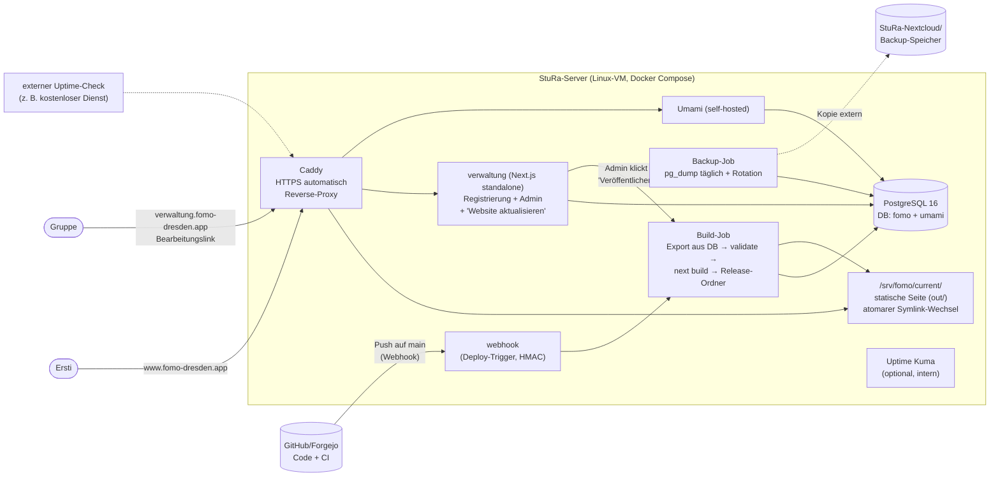

<!-- SPDX-License-Identifier: AGPL-3.0-only -->

# Recherche: Umsetzungsmöglichkeiten und Zielbild „FOMO komplett auf einem StuRa-Server"

**Stand:** 03.10.2026 · Ergänzt `audit.md`. Grundlage: Web-Recherche (Suchergebnisse;
direkte Seitenabrufe waren in der Audit-Umgebung gesperrt, daher Angaben mit
**„laut Quelle"** vor einer Entscheidung kurz gegenprüfen) plus der Code-Stand aus dem
Audit.

---

## 1. Die wichtigsten Erkenntnisse vorweg

| # | Erkenntnis | Folge für FOMO | Quelle |
|---|---|---|---|
| 1 | **Next.js 15 erreicht am 21.10.2026 sein Support-Ende** (danach keine Sicherheitspatches mehr). | Upgrade beider Apps auf **Next.js 16** gehört in die nächsten Wochen, nicht ins „irgendwann". | [endoflife.ai – Next.js 15](https://endoflife.ai/nextjs/15), [HeroDevs – Next.js EOL](https://www.herodevs.com/blog-posts/nextjs-eol-dates-version-support-timeline) |
| 2 | Next.js 16: `next lint` entfernt (Codemod `next-lint-to-eslint-cli`), `eslint`-Key in `next.config` entfällt, `middleware.ts` → `proxy.ts` (alt noch erlaubt, aber deprecated), Mindest-Node 20.9. | Die statische Seite hat `eslint.ignoreDuringBuilds` + `next lint` → anpassen. Die Root-App hat `src/middleware.ts` (next-intl) → umbenennen. | [Next.js 16 entfernt next lint](https://dev.to/mahdi_benrhouma_fe1c6005/nextjs-16-removed-next-lint-eslint-9-migration-390n), [next-intl + Next 16 proxy](https://www.buildwithmatija.com/blog/next-intl-nextjs-16-proxy-fix), [Next.js 16.1 Upgrade-Guide](https://www.wisp.blog/blog/nextjs-16-1-upgrade-guide) |
| 3 | **Node.js 20 ist seit 30.04.2026 EOL.** Node 22 = Maintenance bis 04/2027, **Node 24 = Active LTS bis 04/2028**. Ab Node 27 (Okt. 2026) ein Major pro Jahr. | Docker-Images, CI und Vercel-Einstellung auf **Node 24** festnageln (`.nvmrc`, `engines`). | [endoflife.ai – Node.js](https://endoflife.ai/article-nodejs-eol.html), [UVM – Node 20 retirement](https://silk.uvm.edu/posts/2026/04/nodejs20/) |
| 4 | Die Auth-Lücke in next-auth v5 ist in **`5.0.0-beta.32`** behoben (Install mit Beta-Tag nötig). | Sofort-Fix: `next-auth@5.0.0-beta.32` **plus** im Code `session?.user` statt nur `session` prüfen (Defense in depth). | [GitLab Advisory DB](https://advisories.gitlab.com/npm/next-auth/GHSA-8fpg-xm3f-6cx3/) |
| 5 | **Vercel Hobby ist laut ToS nur für „personal, non-commercial use"**; Studi-Organisationen werden nicht ausdrücklich erwähnt. | Ein weiterer Grund für den StuRa-Server; bis dahin rechtlich unklar. | [Vercel Hobby Plan](https://vercel.com/docs/plans/hobby), [Vercel ToS](https://vercel.com/terms) |
| 6 | **Umami Cloud Hobby: 100k Events/Monat, 6 Monate Aufbewahrung, eingeschränkte API.** | Limit kann zur Erstiwoche reißen; Daten älter als 6 Monate sind weg. **Selbst gehostetes Umami hat weder Limit noch Drittanbieter** → DSGVO einfacher. | [Umami Cloud FAQ](https://docs.umami.is/docs/cloud/faq) |
| 7 | **Geplante GitHub-Workflows werden in öffentlichen Repos nach 60 Tagen ohne Aktivität automatisch deaktiviert.** | Nach der Übergabe stoppt z. B. der Montags-Report still. Auf dem Server besser per `systemd`-Timer/cron. | [GitHub Docs – Workflows deaktivieren](https://docs.github.com/en/actions/how-tos/manage-workflow-runs/disable-and-enable-workflows) |
| 8 | Prisma 7 bringt Breaking Changes (Driver-Adapter Pflicht, `prisma.config.ts`, kein `.env`-Autoload, Generator umbenannt). | **Nicht** mit dem Server-Umzug vermischen; bei Prisma 6.19.x bleiben und Prisma 7 als eigenes, späteres Paket. | [Prisma – Upgrade to v7](https://www.prisma.io/docs/guides/upgrade-guides) |
| 9 | Branch-Protection (PR + Pflicht-Checks) ist für öffentliche Repos auch in GitHub Free verfügbar. | Technische Leitplanke für Mensch **und** KI kostet nichts. | [GitHub Docs – Branch protection](https://docs.github.com/en/repositories/configuring-branches-and-merges-in-your-repository/managing-protected-branches/managing-a-branch-protection-rule) |
| 10 | Claude Code kann per `.claude/settings.json` Dateien/Befehle sperren (`permissions.deny`, z. B. `Read(./.env)`) und per `PreToolUse`-Hook Aktionen vetoen. | KI-Leitplanken lassen sich **technisch** erzwingen, nicht nur aufschreiben. | [Claude Code Settings](https://docs.claude.com/en/docs/claude-code/settings), [Serverworks – permissions + hooks](https://blog.serverworks.co.jp/claude-code-permissions-hooks) |

---

## 2. Was über die StuRa-Infrastruktur bekannt ist

- Der StuRa TU Dresden hat ein **Referat Technik**, das laut eigener Seite Server,
  Arbeitsrechner, Rechteverwaltung und Software betreut; es gibt eine
  Rechnernutzungsrichtlinie. Konkrete Angebote (VMs, Docker-Host, Reverse-Proxy,
  Mailversand, Backup-Speicher) sind **öffentlich nicht beschrieben** →
  **mit dem Referat klären** (Fragenliste in §7).
  Quelle: [StuRa TU Dresden – Referat Technik](https://www.stura.tu-dresden.de/en/referate/technik)
- Die TU Dresden (ZIH) betreibt eine **Enterprise Cloud mit virtuellen Maschinen** und
  **Shibboleth-Login (ZIH-Login)** für Web-Anwendungen; außerdem einen **GitLab-Dienst**
  für TU-Angehörige. Ob Studierendenvertretungen das nutzen dürfen: offen.
  Quellen: [ZIH A–Z](https://tu-dresden.de/zih/a-z), [ZIH Server-Hosting](https://tu-dresden.de/die_tu_dresden/zentrale_einrichtungen/zih/dienste/zusammenarbeiten_und_forschen/server_hosting/docu_rc), [GitLab-Dienst](https://tu-dresden.de/mn/der-bereich/it-kompetenz-und-servicezentrum/gitlab-dienst)
- Beispiel aus Dresden (**HTW**-StuRa, nicht TU): dort laufen Studi-Dienste wie eine
  Nextcloud als Container auf einem eigenen NixOS-Cluster. Zeigt, dass ein
  Container-basierter Betrieb bei Studierendenräten realistisch ist.
  Quelle: [StuRa HTW – Projekt-Ticket](https://pro.stura.htw-dresden.de/issues/1811?tab=notes)

**Konsequenz für den Plan:** Der Plan liefert einen **in sich geschlossenen
Docker-Compose-Stack** (läuft auf jeder Linux-VM mit Docker) und ist so gebaut, dass er
sich anpassen lässt, falls der StuRa schon einen Reverse-Proxy, eine Datenbank oder
Monitoring betreibt.

---

## 3. Zielbild: FOMO auf dem StuRa-Server

**Was sich gegenüber heute grundlegend verbessert:**

1. **Eine Datenquelle, kein Handexport mehr.** Der Build-Job liest die Gruppen direkt
   aus der DB auf demselben Server (vorhandenes Skript
   `scripts/export-static-site-groups.ts`). Ein Admin klickt „Website aktualisieren";
   nach ~1 Minute ist die Änderung live. **Keine PII-Backup-Dateien auf Laptops mehr.**
2. **Logos per Upload** möglich (persistentes Volume statt Vercel-Dateisystem).
3. **Umami ohne Event-Limit und ohne Drittanbieter** (Auftragsverarbeitung entfällt).
4. **Unabhängig von Privat-Accounts** (Vercel, Umami Cloud, ggf. GitHub).
5. **Admin-Bereich zusätzlich abschirmbar** (Caddy-Basic-Auth oder IP-Beschränkung
   auf StuRa-Netz/VPN, später ggf. TU-Shibboleth).

---

## 4. Bewertete Bausteine (mit Empfehlung)

### 4.1 Webserver / Reverse-Proxy

| Option | Pro | Contra | Empfehlung |
|---|---|---|---|
| **Caddy** | HTTPS-Zertifikate automatisch (Let's Encrypt), sehr kurze Config, Static-Files + Proxy in einem | weniger verbreitet als nginx | **✅ Standard**, wenn der StuRa keinen eigenen Proxy hat |
| nginx (vorhanden: `static-site/nginx.conf`) | bekannt, schon im Repo | Zertifikate extra (certbot); vorhandene Config hat Mängel (Security-Header gehen in `location`-Blöcken verloren, Soft-404) | nur, wenn das Referat nginx vorgibt |
| Proxy des StuRa | keine eigene TLS-Verwaltung | Abhängigkeit von dessen Config | **✅ bevorzugt, falls vorhanden** — dann nur Container + Ports liefern |

Quellen: [Docker + Caddy, automatisches HTTPS](https://oneuptime.com/blog/post/2026-01-16-docker-caddy-automatic-https/view), [Caddy Best Practices](https://fivenines.io/blog/how-to-deploy-and-configure-caddy-web-server/), [Caddy: Basic-Auth vor Admin-Pfaden](https://www.projectnomad.us/install/caddy)

> ⚠️ `.app`-Domains stehen auf der HSTS-Preload-Liste → **nur HTTPS**. Ein Betrieb
> „erst mal über HTTP auf Port 8080" (so in `INBETRIEBNAHME.md`) funktioniert mit
> fomo-dresden.app **nicht**.

### 4.2 Statische Seite

- Next.js-Static-Export läuft auf **jedem** Webserver; kein Node zur Laufzeit.
  Quelle: [Next.js – Self-Hosting](https://nextjs.org/docs/15/app/guides/self-hosting)
- Vorhanden und wiederverwendbar: `static-site/scripts/update-data.sh`
  (Release-Ordner + Symlink-Wechsel + Rollback). Mängel aus dem Audit vorher beheben
  (Rollback bei fehlgeschlagener Validierung, leeres `UMAMI_SRC`).

### 4.3 Registrierungs-/Admin-App

| Option | Aufwand | Wartung danach | Bewertung |
|---|---|---|---|
| **Next.js behalten, verschlanken, `output:"standalone"` im Docker-Container** | **M** | mittel (Next/Auth/Prisma-Updates) | **✅ Empfehlung** — kein Neuschreiben, KI kann inkrementell umbauen |
| PocketBase (ein Go-Binary: SQLite, Auth, Admin-Oberfläche, Datei-Upload) | L (Registrierung neu bauen) | niedrig, aber **vor 1.0** (Breaking Changes zwischen Versionen möglich) | interessant für „Version 3"; jetzt zu großer Umbau |
| Formular-Tool (Nextcloud Forms, LimeSurvey) + Datei im Repo | L | niedrig | 21 Likert-Items + Vorbefüllung bestehender Ratings kaum sauber abbildbar |
| Git-basiertes CMS (Decap CMS) für `groups.json` | M | niedrig | gut für **Texte** (FAQ, Startseite) durch Nicht-Techniker; für Gruppen-Self-Service ungeeignet (Gruppen bräuchten Git-Accounts) |

Quellen: [Next.js in Docker (standalone)](https://docs.docker.com/guides/nextjs/containerize.md), [Auth.js hinter Reverse-Proxy: `AUTH_TRUST_HOST`](https://www.achromatic.dev/blog/self-host-nextjs-saas-with-docker), [Sicherheitstipps Next.js in Docker](https://blog.arcjet.com/security-advice-for-self-hosting-next-js-in-docker/), [PocketBase Self-Hosting-Guide 2026](https://ossalt.com/guides/self-hosting-guide-pocketbase-2026), [PocketBase vs. Supabase 2026](https://stacknotice.com/blog/pocketbase-vs-supabase-2026), [Decap CMS – Backends](https://www.DecapCMS.org/docs/backends-overview/), [Git-basierte CMS im Vergleich](https://www.layer3labs.io/guides/git-based-cms)

> Wichtig beim Self-Hosting mit Auth.js: **`AUTH_TRUST_HOST=true`** und **`AUTH_URL`**
> setzen. `NEXTAUTH_URL` allein reicht nicht; fehlt das, wirft Auth.js `UntrustedHost`
> — was mit dem alten Prüfmuster ebenfalls „fail-open" wäre.

### 4.4 Dauerhafter Bearbeitungslink für Gruppen (statt Einmal-Token)

Zwei bewährte Muster:

1. **DB-gestützter Langzeit-Token** (empfohlen, weil die DB ohnehin da ist): pro Gruppe
   ein zufälliger Token, in der DB **nur als Hash** gespeichert, mehrfach nutzbar,
   widerrufbar („Link neu erzeugen" macht den alten ungültig).
2. **Stateless HMAC-signierter Link** (`slug + Ablaufdatum + Signatur`): braucht keine
   DB, aber Widerruf nur über Schlüsselrotation (alle Links auf einmal).

Plus: **„Link anfordern"-Seite** — Gruppe gibt ihren Gruppennamen ein, der Link geht
**ausschließlich an die bei uns hinterlegte Adresse**; die Seite verrät nicht, ob eine
Adresse existiert. Braucht **SMTP** (StuRa-Mailserver oder Funktionspostfach).

Quellen: [HMAC-signierte URLs](https://flaviocopes.com/hmac-signed-urls-cloudflare-workers.md), [Magic-Link-Leitfaden](https://clerk.com/blog/magic-links.md), [url-shield (npm)](https://www.npmjs.com/package/url-shield)

### 4.5 Datenbank-Backups

- Täglicher `pg_dump` in einem eigenen Container, Rotation (z. B. 7 täglich, 4
  wöchentlich, 6 monatlich), **Kopie außerhalb des Servers**, **Restore regelmäßig
  testen** — „Volumes schützen nicht vor Host-Ausfall, versehentlichem Löschen oder
  Korruption".
  Quellen: [Automatisierte DB-Backups in Docker](https://oneuptime.com/blog/post/2026-02-08-how-to-set-up-automated-database-backups-in-docker/markdown), [pg_dump-Leitfaden](https://dev.to/dmdboi/automated-postgresql-backups-in-docker-complete-guide-with-pgdump-52a), [Postgres sicher sichern](https://akashrajpurohit.com/blog/safely-backup-postgresql-database-in-docker-podman-containers/)

### 4.6 Analytics

- **Umami self-hosted**: offizielles Setup = 2 Container (Umami + PostgreSQL), läuft auf
  der vorhandenen Postgres-Instanz als zweite Datenbank. Cookielos; Rechtsgrundlage
  trotzdem dokumentieren.
  Quellen: [Umami in Docker](https://oneuptime.com/blog/post/2026-02-08-how-to-run-umami-analytics-in-docker/markdown), [Umami Self-Hosting 2026](https://ossalt.com/guides/self-host-umami-2026), [Matomo/Umami DSGVO-konform selbst hosten](https://danubedata.ro/blog/self-host-matomo-umami-google-analytics-alternative-2026)
- `report.mjs` unterstützt den Self-Hosted-Modus bereits (`UMAMI_URL`, `UMAMI_USER`,
  `UMAMI_PASSWORD`).

### 4.7 Monitoring und Fehler

- **Uptime Kuma** (Container, Mail-Benachrichtigung) für Erreichbarkeit + Zertifikat;
  **zusätzlich ein externer Check**, weil ein Monitor auf demselben Server nicht meldet,
  wenn der Server selbst ausfällt.
  Quellen: [Uptime Kuma Überblick](https://dev.co/devops/open-source/uptime-kuma), [Uptime Kuma Self-Hosting-Guide](https://www.nzian.xyz/blog/self-hosting-uptime-kuma-a-complete-guide-to-open-source-server-monitoring)
- **GlitchTip** (Sentry-kompatibel, ein Container) optional für Fehler der Admin-App.
  Für ein kleines internes Tool reicht anfangs `docker compose logs`.
  Quelle: [GlitchTip](https://alternativeto.net/software/glitchtip)

### 4.8 Deployment auf den Server

| Option | Wie | Bewertung |
|---|---|---|
| **Webhook auf dem Server** (`adnanh/webhook`) | GitHub/Forgejo ruft bei Push eine HMAC-geschützte URL auf → `deploy.sh` (git pull, Build, Symlink-Wechsel) | **✅ Empfehlung** — braucht nur Port 443 (Uni-Firewalls blocken oft SSH von außen) |
| GitHub Action mit SSH/rsync | Action baut, kopiert per SSH | braucht eingehendes SSH + Schlüssel in GitHub-Secrets |
| Pull per `systemd`-Timer | Server prüft alle X Minuten auf neue Commits | einfach, robust, minimal verzögert — gute Rückfallebene |

Quellen: [Webhooks für Self-Hosted-Deploys](https://dev.to/severo/using-webhooks-to-update-a-self-hosted-jekyll-blog-59al), [Deploy per Webhook](https://medium.com/the-sysadmin/deploy-from-github-gitlab-to-server-using-webhook-d1cb6496368f)

### 4.9 Code-Hosting langfristig

- **GitHub** (in eine Organisation des StuRa/YETI übertragen): kostenlos, Branch-
  Protection gratis, KI-Tools gut integriert. **Empfehlung für jetzt.**
- **Forgejo** (selbst gehostet, gemeinnützig getragen, ~170 MB RAM, Actions-Runner):
  sinnvoll, falls der StuRa **alles** im eigenen Haus will. Später möglich, kein
  Muss.
  Quellen: [Forgejo selbst hosten 2026](https://ossalt.com/guides/how-to-self-host-forgejo-github-alternative-2026), [Forgejo Actions](https://computingforgeeks.com/install-forgejo-actions-ci/)

### 4.10 Domain

- fomo-dresden.app hat Vercel-Nameserver; falls bei Vercel registriert: Transfer per
  EPP-/Auth-Code aus dem Vercel-Dashboard (Domain muss ≥ 60 Tage registriert sein,
  Vercel nimmt keine Gebühr, neuer Registrar ggf. ein Jahr Verlängerung). **Vorher**
  DNS umstellen, dann transferieren → kein Ausfall.
  Quellen: [Domain aus Vercel transferieren](https://vercel.com/kb/guide/how-do-i-transfer-my-domain-out-of-vercel), [Vercel – Domains transferieren](https://vercel.com/docs/domains/working-with-domains/transfer-your-domain)

---

## 5. Tipps aus der Recherche, direkt übertragbar

1. **Erst stabilisieren, dann umziehen.** Sicherheitsfixes, Build-Fix und Next-16-Upgrade
   noch auf Vercel erledigen; der Umzug verschiebt dann nur noch funktionierenden Code.
2. **Migrationen nie im Build.** Auf dem Server als eigenen, bewussten Schritt nach einem
   frischen Backup (`deploy.sh`: Backup → `prisma migrate deploy` → Neustart).
3. **Standalone-Docker-Image:** `.next/static` und `public/` müssen extra ins Image
   kopiert werden — häufigster Fehler.
4. **Reverse-Proxy immer davor** (Request-Limits, langsame Verbindungen, Rate-Limiting).
5. **Admin doppelt absichern:** App-Login **und** Proxy-Schutz (Basic-Auth/IP).
6. **Backups erst „echt", wenn ein Restore getestet wurde** — als halbjährliche Aufgabe in
   den Wartungskalender.
7. **Externer Uptime-Check** zusätzlich zum internen Monitor.
8. **Cron/Timer statt GitHub-Schedules** für alles, was nach der Übergabe weiterlaufen
   muss (60-Tage-Abschaltung).
9. **KI-Leitplanken technisch:** `.claude/settings.json` (`deny` für `.env`, Backups,
   `git push origin main`, `prisma migrate deploy`) + Branch-Protection.
10. **Prisma 7 und Next 16 nicht gleichzeitig** — ein großer Umbau pro PR.

---

## 6. Empfohlene Reihenfolge (Kurzfassung — Details im Umsetzungsplan)

1. **Notfall** (diese Woche): Auth-Fix, Build-Fix, Leak schließen, Daten einmal syncen.
2. **Qualitäts-Netz:** CI, Tests, `validate` im Build, KI-Leitplanken, Branch-Protection.
3. **Next.js 16 + Node 24** (Support-Ende Next 15 am 21.10.2026).
4. **Datenpflege reparieren:** dauerhafter Link, Verifizierung bleibt, Formular-Bugs.
5. **Verschlanken:** Pilot/Studie 2/Demo/altes Quiz raus (nach Archiv-Export).
6. **StuRa-Server:** Compose-Stack, DB-Umzug, Umami-Umzug, Backups, Monitoring,
   DNS-Wechsel, Vercel abschalten.
7. **Übergabe:** Accounts, Domain, Impressum, Doku.

---

## 7. Fragen an das Referat Technik des StuRa (vor Phase 6 klären)

1. Gibt es eine **VM oder einen Docker-Host** für Projekte? Welches OS, wie viel RAM/CPU/
   Speicher? (Bedarf grob: 2 vCPU, 4 GB RAM, 20 GB Platte reichen für den ganzen Stack.)
2. Gibt es einen **zentralen Reverse-Proxy** (dann liefern wir nur Container + Ports)
   oder sollen wir **Caddy** mitbringen?
3. Sind **Ports 80/443 von außen** erreichbar? Ist **eingehendes SSH** erlaubt?
4. Gibt es einen **SMTP-Zugang/Funktionspostfach** für Bearbeitungslinks
   (z. B. `fomo@…`)?
5. Gibt es **Backup-Speicher** außerhalb der VM (Nextcloud, NAS, ZIH-Backup)?
6. Wer hat **Root-Zugang**, wer macht OS-Updates, gibt es Monitoring?
7. Dürfen wir **TU-Shibboleth (ZIH-Login)** für den Admin-Bereich nutzen?
8. Soll die Domain **fomo-dresden.app** bleiben oder unter eine StuRa-Domain wandern
   (z. B. `fomo.stura.tu-dresden.de`)? (Bei Wechsel: Weiterleitung einrichten, SEO!)
9. Bevorzugt der StuRa **GitHub (Organisation)** oder ein eigenes Git (Forgejo/TU-GitLab)?
